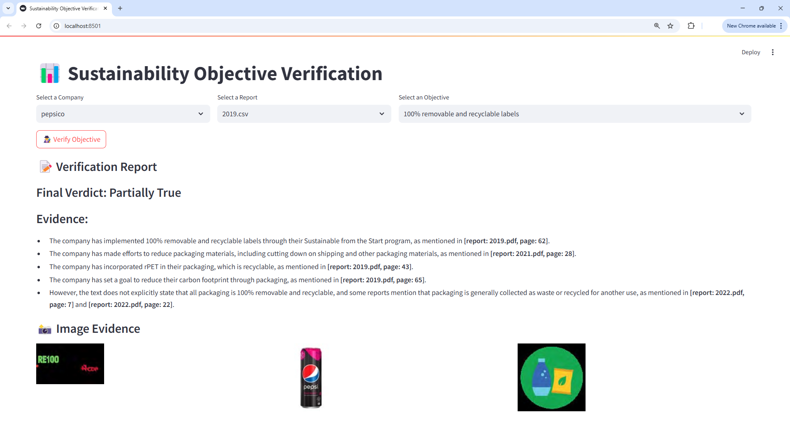

# Sustainability Fact Checker

**Sustainability Fact Checker** is a system designed to verify corporate sustainability claims using multimodal textual and visual evidence extracted from sustainability reports. It supports auditors, investors, and other stakeholders by enhancing the transparency and verifiability of these reports.


## Features

- Extracts textual and visual content from sustainability reports.
- Uses CLIP to embed text blocks and images.
- Stores and retrieves relevant textual and visual evidence for specific sustainability objectives.
- Generates fact-checking reports using LLaMA.
- Offers both Jupyter Notebook and Streamlit interfaces for interactive exploration.


## Installation

```bash
git clone https://github.com/m-mahdavi/sustainability-fact-checker.git
cd sustainability-fact-checker
pip install .
```


## Usage 

- To use the system in a Jupyter Notebook interface, run: ```jupyter notebook notebooks/fact_checking.ipynb```
- To launch the web-based user interface with Streamlit, run: ```streamlit run source/fact_checking_app.py```




## Citation

If you use this repository in your research, please cite the following paper:

```bibtex
@inproceedings{mahdavi2025fact,
  title={Fact-checking sustainability objectives using multimodal retrieval-augmented generation},
  author={Mahdavi, Mohammad and Farahmand, Amirhosein and Nadi, Abolfazl},
  booktitle={2025 IEEE International Conference on Data Mining Workshops (ICDMW)},
  year={2025}
}
```